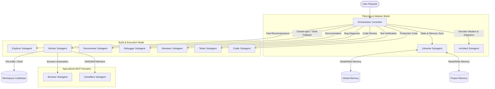

# OpenCode Orchestrator Suite

Production-grade multi-agent orchestration ecosystem for **OpenCode** featuring dual-mode execution (Plan vs Build), strict MCP tool isolation, and a 2-level hierarchical memory model.

---

## 📐 Architecture Topology



---

## 🚀 Key Highlights & Protocols

1. **Dual-Mode Execution (Plan vs Build):**
   - **Plan Mode:** Interactive discovery, socratic dialog with `@architect`, state tracking with `@librarian`, and plan persistence in `.opencode/plans/`.
   - **Build Mode:** Dynamic routing with no fixed pipeline: `@coder/@tester/@reviewer/@debugger/@documenter` for code lifecycle, `@worker` as shell fallback, `@explorer/@cloudflare/@browser` for recon/infra/web.

2. **English Subagent Prompting Protocol:**
   - All internal agent prompts, subagent delegations, architecture specifications, and code comments strictly adhere to dense technical English to optimize LLM context utilization and token density.

3. **Strict MCP Tool Isolation & Scoping:**
   - High-overhead tool schemas (e.g. Cloudflare, Browser Puppeteer) are isolated within dedicated subagents to maintain lean context windows and zero tool collision in main workflows.

4. **2-Level Hierarchical Memory:**
   - **Global Scope:** Cross-project user preferences, persona rules, and global search conventions.
   - **Project Scope:** Local project architecture, security watchlists, and key decision logs maintained in `.opencode/memory/project.md`.

---

## 🛠️ Installation & Setup

### Automated Installation

Run the provided installation script:

```bash
# Clone the repository
git clone https://github.com/berndof/opencode-orchestrator.git
cd opencode-orchestrator

# Standard copy installation
./install.sh

# Symlink mode (recommended for development)
./install.sh --symlink

# Custom target directory
./install.sh --target ~/.config/opencode --force
```

### Manual Configuration

1. Copy agents to `~/.config/opencode/agents/`:
   ```bash
   cp agents/*.md ~/.config/opencode/agents/
   ```
2. Copy memory files to `~/.config/opencode/memory/`:
   ```bash
   cp memory/*.md ~/.config/opencode/memory/
   ```
3. Copy template for project memory:
   ```bash
   cp templates/opencode.json.example ~/.opencode.json
   ```

---

## 📂 Repository Structure

```
opencode-orchestrator/
├── agents/                  # Specialized agent prompt definitions
│   ├── orchestrator.md      # Controller / Main Orchestrator agent
│   ├── architect.md         # Solution design & Mermaid diagrams
│   ├── coder.md             # Production code implementation specialist
│   ├── tester.md            # Test execution & verification agent
│   ├── reviewer.md          # Static analysis & code review specialist
│   ├── debugger.md          # Root cause analysis & bug fix agent
│   ├── documenter.md        # Technical documentation & markdown agent
│   ├── worker.md            # Shell execution & fallback actuator
│   ├── explorer.md          # Fast code discovery & search
│   ├── librarian.md         # Hierarchical memory & state manager
│   ├── cloudflare.md        # Cloudflare DNS/WAF/Workers specialist
│   └── browser.md           # Web search & browser automation agent
├── memory/                  # Hierarchical memory blocks
│   ├── persona.md           # Persona & memory guidelines
│   ├── human.md             # Collaboration & interaction preferences
│   ├── global-file-search-rules.md # File search rules
│   └── templates/           # Memory templates
│       └── project.md.template
├── templates/               # Workspace configuration examples
│   └── opencode.json.example
├── install.sh               # Colorized installer with backup support
├── LICENSE                  # MIT License
└── README.md                # Documentation & Architecture Overview
```

---

## 📄 License

Distributed under the [MIT License](LICENSE). Copyright © 2026 Bernardo.
